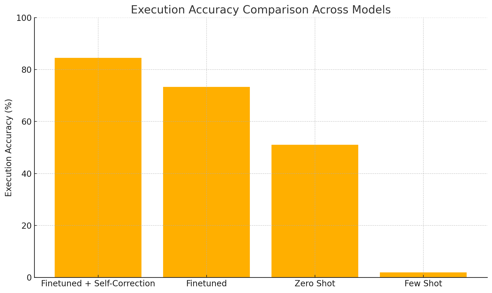
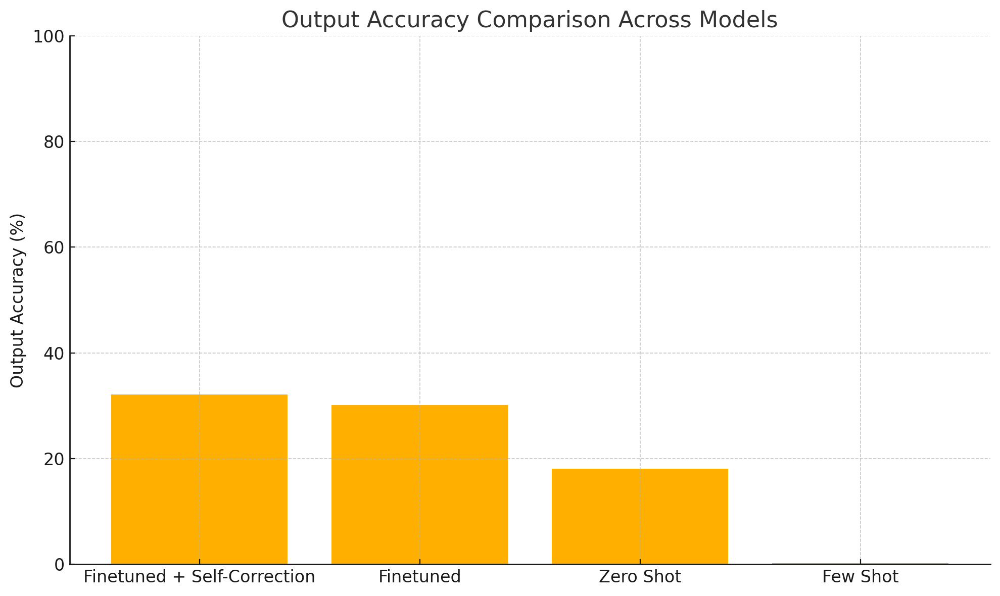
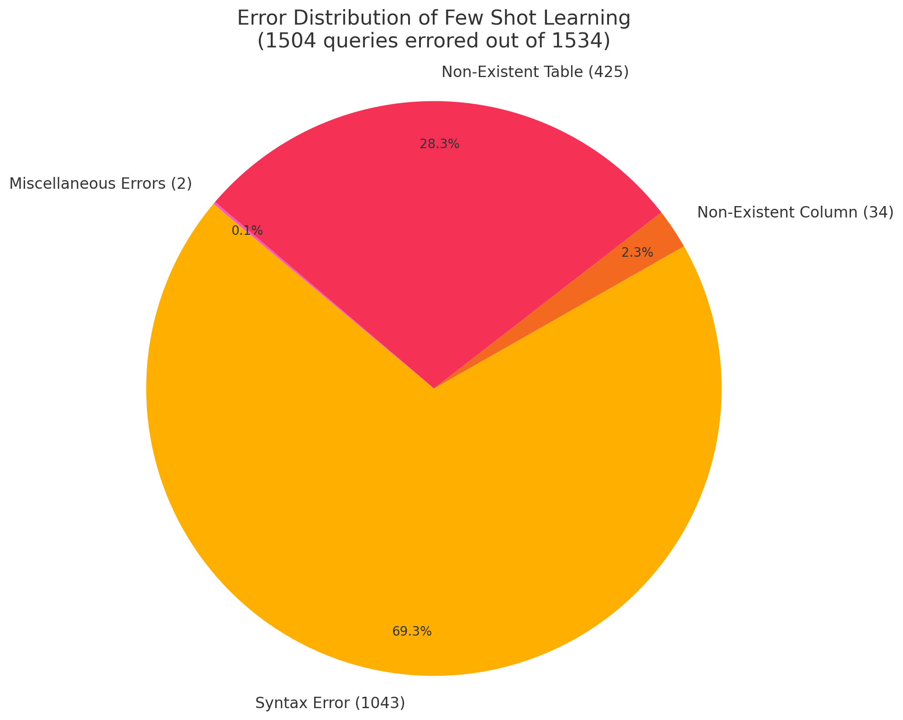
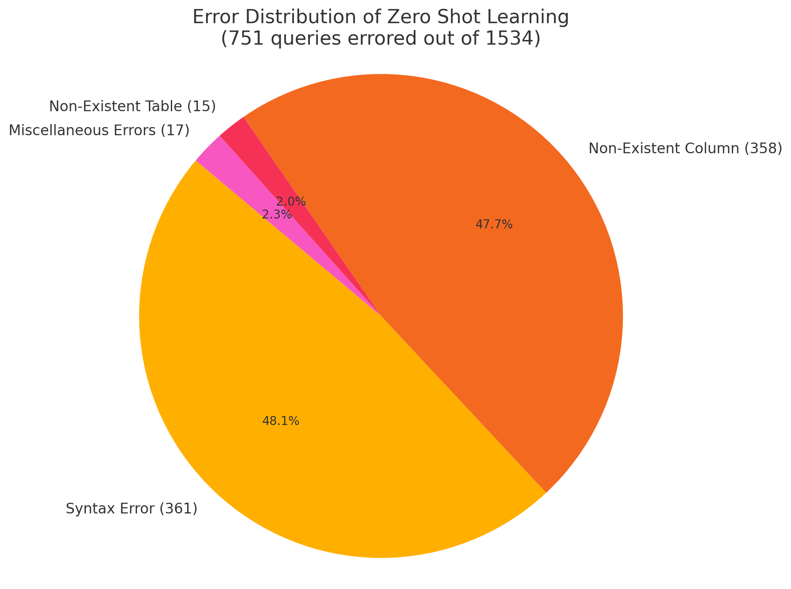
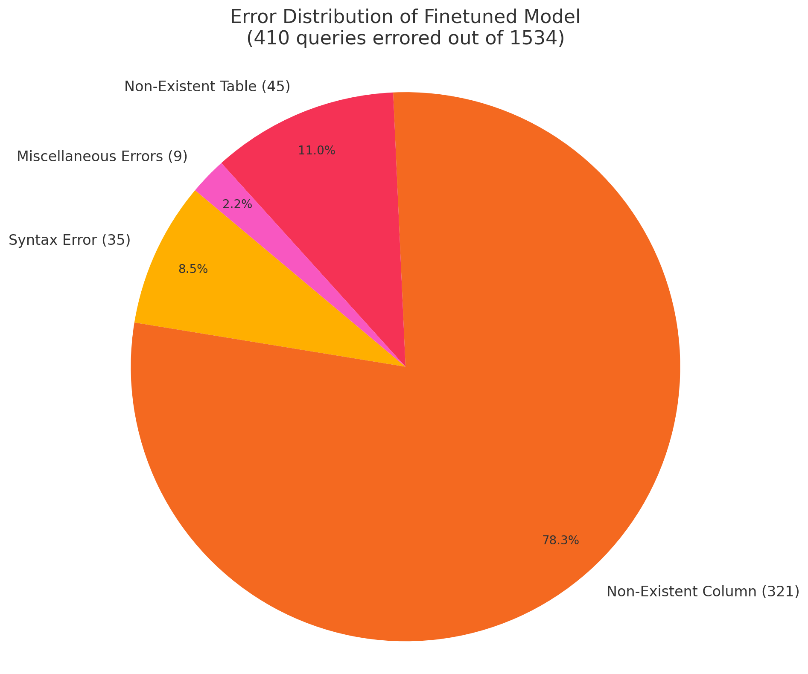
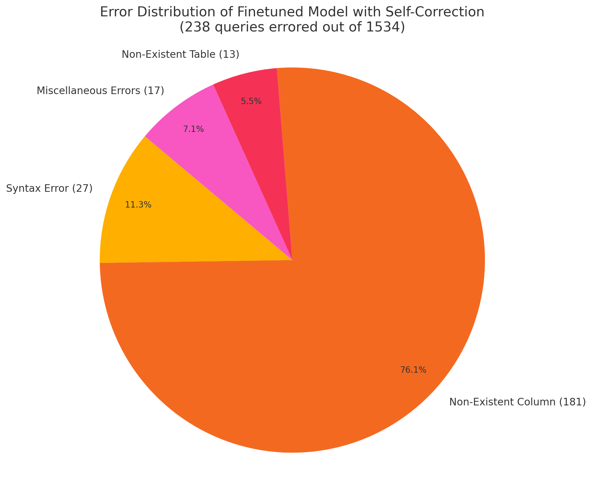

# Text-to-SQL: A Comparison Study

This project explores how different prompting strategies, model fine-tuning, and a self-correcting feedback loop impact the ability of a large language model to translate natural language questions into executable SQL queries.

## What is Text-to-SQL?

**Text-to-SQL** is a natural language processing task where the goal is to convert a user's question or instruction into a valid and executable SQL query.

It enables users — even those unfamiliar with SQL — to interact with databases using plain English.

### Example

**Input (natural language):**

*"List the names of all customers who made purchases over $1000 in the last month."*

**Output (SQL):**  

```sql
SELECT
customer_name
FROM
purchases
WHERE
amount > 1000 AND purchase_date >= DATE('now', '-1 month');
```

In this project, we generate such SQL queries using large language models (LLMs), evaluate their correctness by executing them, and even apply automated correction when the model fails to produce a working query.

## Motivation

Inspired by Uber’s [QueryGPT](https://www.uber.com/blog/query-gpt/), our project explores the effectiveness of prompting strategies and fine-tuning for translating natural language into structured SQL queries.

### Why Uber invested in QueryGPT?

- **Need:** Uber's teams, including engineers and data scientists, frequently craft SQL queries to access and analyze vast datasets. This process is time-consuming, especially for those less familiar with SQL syntax and Uber's complex data models.

- **Methodology:** QueryGPT leverages large language models (OpenAI), vector databases, and similarity search techniques to translate natural language prompts into SQL queries. It incorporates features like "workspaces" tailored to specific business domains and a "Table Agent" that assists users in selecting appropriate tables, enhancing the relevance and accuracy of generated queries.

- **Impact:** By automating SQL query generation, QueryGPT reduces the time required to create queries from approximately 10 minutes to about 3 minutes, significantly boosting productivity across Uber's operations.

## Our Methodology

### Dataset: BirdSQL Benchmark

We use the [BirdSQL](https://bird-bench.github.io/) dataset — a recent benchmark specifically designed to evaluate the text-to-SQL capabilities of large language models.

- **Multi-domain coverage:** Includes diverse databases like `student_loan`, `retails`, `simpson_episodes`, `law_episode`, and more.
- **Complexity:** Questions span basic retrieval to nested queries, aggregations, joins, and subqueries.
- **Split:** We use the official `train_set` and `dev_set`:
  - `train_set.csv`: ~9400 examples
  - `dev_set.csv`: ~1500 examples 

Each example consists of:
- A natural language question
- The corresponding target database schema (SQLite)
- The expected output (SQL query)

This makes BirdSQL ideal for evaluating **execution accuracy** and **generalization across schemas**.

### Model

- We used LLaMa 3.2 3B model for both prompting and finetuning.
- Used Ollama to host the model locally.
- Used Unsloth for model finetuning.

### Pipelines

We compare 4 approaches to Text-to-SQL: prompting - zero-shot and few-shot, fine-tuning, and error-aware correction on fine-tuned model.

## Approach 1: Zero-Shot Prompting

- From `dev_set`, the model was given
    - db schema
    - Question
    - Hint

## Approach 2: Few-Shot Prompting

- 2 random examples from `train_set` in addition to `Approach 1` items.

## Approach 3: Model Finetuning

- Trained on the `train_set` of BirdSQL
- Each training sample includes:
  - db schema
  - Question
  - Hint
  - SQL
- This step drastically improved:
  - Query structure
  - Keyword alignment (SELECT, WHERE, JOINs)
  - Column and table usage matching the schema

## Approach 4: Model Finetuning with Self-Correction Loop

- Despite fine-tuning, models occasionally generate SQL that fails execution due to:
  - Syntax errors
  - Invalid columns/tables
  - Logical flaws
- To handle this, we introduced a **self-correction loop**:
  1. Execute the model’s SQL using a SQLite engine.
  2. If execution fails, capture the error.
  3. Construct a new prompt with:
     - Database schema
     - Error message
     - Faulty SQL query
  4. Send it back to the LLM to revise the SQL.
     - This step alone boosted executable accuracy significantly and closely mimics how a human would debug SQL.

## Evaluation & Results

We evaluated each stage of our system using two key metrics:

- **Execution Accuracy:** Does the query execute correctly on the target database?
- **Output Accuracy:** Does the output of the generated query exactly matches to that of the gold SQL?

### Accuracy Comparison





| Model Variant              | Execution Accuracy | Output Accuracy |
|----------------------------|--------------------|-----------------|
| Finetuned + Self-Correction| **85.1%**          | **30.8%**       |
| Finetuned Only             | 72.5%              | 28.3%           |
| Zero-Shot Prompting        | 50.1%              | 18.0%           |
| Few-Shot Prompting         | 2.0%               | 0.2%            |

### Error-Type Breakdown









| Model Variant              | Total Errors | Top Error Type       |
|----------------------------|--------------|----------------------|
| Few-Shot Prompting         | 1504         | Syntax (69.3%)       |
| Zero-Shot Prompting        | 751          | Syntax (48.1%)       |
| Finetuned Only             | 410          | Column (78.3%)       |
| Finetuned + Self-Correction| **238**      | Column (76.1%)       |

## Critical Analysis

### Key Insights

- **Fine-tuning** significantly improves structural and syntactic alignment, but still leaves room for semantic mistakes.
- **Self-correction loops** are an effective, lightweight way to improve model reliability without retraining.
- **Prompt engineering alone is not enough** — zero/few-shot prompting lacks robustness when dealing with diverse or complex schemas.

### Next Steps

- Use RAG to fetch similar examples for few-shot prompting.
- Use larger models.
